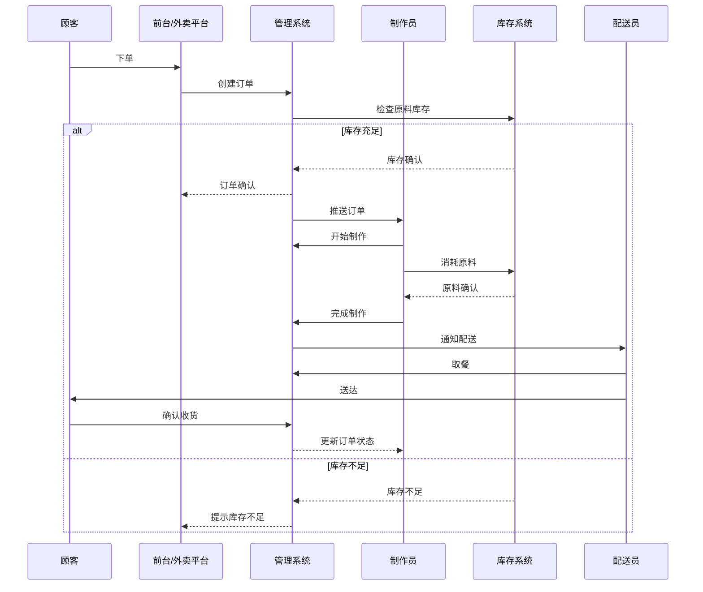
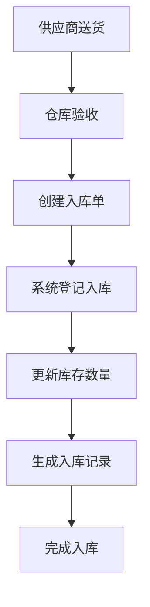

# 奶茶店订单制作与原料库存管理系统概要设计文档

## 1. 系统架构设计

### 1.1 总体架构
- **架构风格**：前后端分离架构
- **分层设计**：
  - 表示层（前端Vue应用）
  - 控制层（Spring Boot Controllers）
  - 业务逻辑层（Service层）
  - 数据访问层（Mapper层）
  - 数据存储层（MySQL、Redis）
  - 大模型集成层（暂不开发）

### 1.2 技术架构
- **后端**：
  - Spring Boot 2.5.x
  - Spring Security + JWT
  - MyBatis
  - MySQL 8.0
  - Redis
  - Swagger 3.0
- **前端**：
  - Vue 3.9.0
  - Element UI
  - Vuex + Vue Router
  - Axios

### 1.3 模块划分
- **系统管理模块**：用户、角色、权限、菜单、字典等基础功能
- **订单管理模块**：订单创建、处理、查询、统计等
- **原料库存模块**：原料管理、库存监控、出入库操作等
- **大模型应用模块**：智能推荐、客服、预测等功能（暂不开发）
- **报表分析模块**：各类数据报表生成与展示

## 2. 关键业务流程设计

### 2.1 订单处理流程

### 2.2 原料入库流程

## 3. 数据库设计

### 3.1 核心数据表
- **sys_user**：系统用户表
- **sys_role**：角色表
- **sys_menu**：菜单表
- **sys_dept**：部门表
- **sys_dict_data**：字典数据表
- **product_category**：产品分类表
- **product_info**：产品信息表
- **product_formula**：产品配方表
- **material_category**：原料分类表
- **material_info**：原料信息表
- **stock_info**：库存信息表
- **stock_record**：库存变动记录表
- **order_main**：订单主表
- **order_detail**：订单明细表
- **order_status_history**：订单状态历史表
- **purchase_order**：采购订单表
- **purchase_detail**：采购明细表

### 3.2 数据结构关系
- 产品与原料：多对多关系，通过配方表关联
- 订单与产品：一对多关系，一个订单包含多个产品
- 原料与库存：一对一关系，每种原料对应一条库存记录
- 用户与角色：多对多关系，通过用户角色关联表

## 4. 接口设计

### 4.1 订单相关接口
- POST /api/order/create：创建订单
- GET /api/order/list：查询订单列表
- GET /api/order/{id}：获取订单详情
- PUT /api/order/{id}/status：更新订单状态
- POST /api/order/{id}/cancel：取消订单

### 4.2 库存相关接口
- GET /api/stock/list：查询库存列表
- GET /api/stock/{id}：获取库存详情
- POST /api/stock/in：原料入库
- POST /api/stock/out：原料出库
- PUT /api/stock/{id}/alert：设置预警阈值

### 4.3 大模型相关接口（暂不开发）
- POST /api/ai/recommend：智能推荐
- POST /api/ai/chat：智能客服
- GET /api/ai/forecast：需求预测

## 5. 部署架构

### 5.1 硬件架构
- Web服务器：Nginx
- 应用服务器：Tomcat
- 数据库服务器：MySQL主从架构
- 缓存服务器：Redis集群

### 5.2 软件架构
- 前端部署：Nginx静态资源服务
- 后端部署：Docker容器化部署
- 数据库：MySQL 8.0主从复制
- 缓存：Redis 6.0集群
- 日志：ELK日志收集与分析

## 6. 安全设计

### 6.1 认证授权
- JWT token认证
- 基于RBAC的权限控制
- 接口访问鉴权

### 6.2 数据安全
- 敏感数据加密存储
- HTTPS传输加密
- 数据备份与恢复机制

### 6.3 安全防护
- SQL注入防护
- XSS攻击防护
- CSRF防护
- 接口频率限制